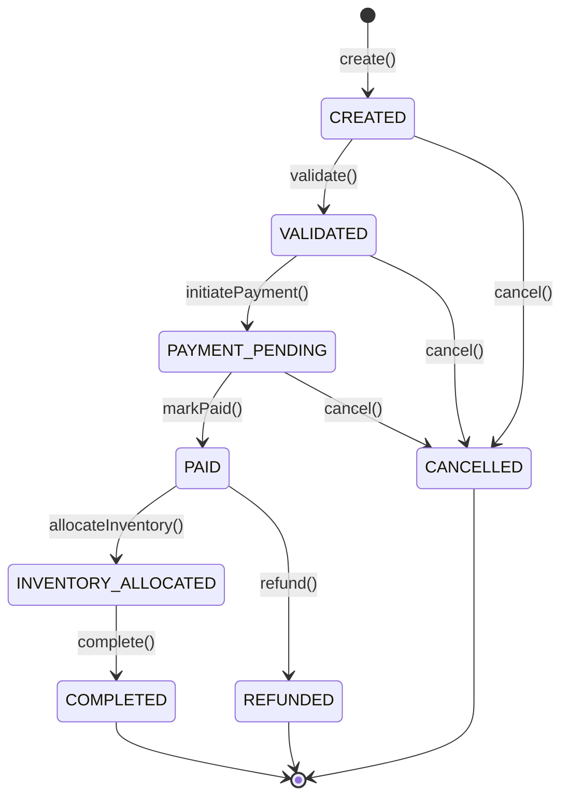

# Event-Driven Order Processing & Workflow Engine

[](https://openjdk.org/projects/jdk/21/)
[](https://spring.io/projects/spring-boot)
[](docs/architecture.md)
[](https://www.archunit.org/)
[](https://www.postgresql.org/)
[](LICENSE)

An enterprise-grade, high-throughput, fault-tolerant **Event-Driven Order Processing & Workflow Engine** engineered in **Java 21 LTS** and **Spring Boot 3.3+**. 

The system solves mission-critical distributed systems challenges: strict transactional consistency, zero dual-write message loss (Transactional Outbox Pattern), distributed transaction compensation (Saga Orchestration), and end-to-end observability.

---

## 🏛 Architectural Blueprint

Built with strict **Hexagonal Architecture (Ports and Adapters)** and **Domain-Driven Design (DDD)**:

```
com.engine.order/
├── domain/                         # Pure Java 21: ZERO framework/JPA/Spring imports
│   ├── model/                      # Aggregate Root (Order), Entities, Value Objects
│   ├── event/                      # Sealed Domain Events
│   ├── exception/                  # Domain-specific Exceptions
│   └── port/                       # Driving (in) & Driven (out) Interfaces
├── application/                    # Application Services & DTOs
│   ├── service/                    # OrderCommandService, OrderQueryService
│   └── dto/                        # Command & Response Records
└── infrastructure/                 # Concrete Adapters & Configuration
    ├── adapter/
    │   ├── in/rest/                # REST Controllers, RFC 7807 Exception Handlers
    │   └── out/persistence/        # JPA Entities, Spring Data, Mappers, Adapters
    ├── config/                     # OpenAPI, Domain Beans
    └── security/                   # Idempotency Filter
```

---

## 🔄 Deterministic Domain State Machine

The order lifecycle transitions through well-defined, immutable states enforced by domain invariants:



---

## 🚀 Features by Level

- [x] **Level 1: Pure Hexagonal Core & Deterministic State Machine**
  - Pure Java 21 domain aggregate with zero third-party dependencies.
  - Invariant validation (non-empty items, monetary consistency, currency matching).
  - Driving Ports (`CreateOrderUseCase`, `ProcessPaymentUseCase`, `CancelOrderUseCase`, `GetOrderQuery`).
  - Driven Ports (`OrderRepositoryPort`, `EventPublisherPort`, `IdempotencyStorePort`).
  - PostgreSQL schema with Flyway database migration (`V1__init_order_schema.sql`).
  - JPA persistence entities with Optimistic Locking (`@Version`).
  - REST API (`/api/v1/orders`) with RFC 7807 `ProblemDetail` errors and `Idempotency-Key` filter.
  - Quality Gate: Comprehensive JUnit 5 + AssertJ unit tests and strict ArchUnit architectural enforcement.
- [x] **Level 2: Asynchronous Event-Driven & Transactional Outbox Pattern**
  - Elimination of dual-write loss via PostgreSQL `outbox_messages` table and Flyway `V2__init_outbox_and_idempotent_consumer.sql`.
  - Atomically writes domain events in the same database transaction as the aggregate state mutation.
  - `OutboxRelayScheduler` worker polling pending events with `SELECT ... FOR UPDATE SKIP LOCKED` (safe for multi-instance scaling).
  - Idempotent Apache Kafka producer (`acks=all`, `enable.idempotence=true`, `retries=3`) publishing to `order.events`.
  - Idempotent Consumer Pattern deduplicating incoming events via `consumed_messages` table.
  - Complete `docker-compose.yml` with PostgreSQL 16, Apache Kafka (KRaft mode), and Kafdrop.
  - Quality Gate: Integration tests with embedded Kafka verifying atomic outbox insert, relay dispatch, and consumer deduplication.
- [x] **Level 3: Distributed Transactions & The Saga Pattern (Orchestration Mode)**
  - `OrderFulfillmentSagaManager` coordinating the distributed multi-step workflow: Reserve Inventory -> Authorize Payment -> Complete Order.
  - Saga state persistence in PostgreSQL via `saga_instances` table and Flyway `V3__init_saga_and_dlq_schema.sql`.
  - Automated Compensating Transactions:
    - If payment authorization fails: triggers `ReleaseInventoryCommand` rollback and marks order `CANCELLED`.
    - If inventory reservation fails: cancels order immediately without requesting payment.
  - Simulated downstream microservices (`SimulatedInventoryService` and `SimulatedPaymentService`) with configurable failure scenarios.
  - Dead Letter Queue (`order.events.dlq`) and topics (`inventory.commands`, `inventory.replies`, `payment.commands`, `payment.replies`).
  - Quality Gate: Comprehensive integration tests covering Happy Path fulfillment, payment failure compensation, and inventory out-of-stock rollback.
- [x] **Level 4: Enterprise Production-Ready (Observability, CQRS & Resilience)**
  - **CQRS Read Projection**:
    - Denormalized `order_summary_view` table via Flyway `V4__init_cqrs_read_model.sql`.
    - `OrderSummaryProjectionConsumer` asynchronously listening to `order.events` to maintain optimized query read projections.
    - High-throughput query endpoints: `GET /api/v1/orders/summary` (with filters for customer & status) and `GET /api/v1/orders/summary/{orderId}`.
  - **Distributed Tracing & Metrics Observability**:
    - Micrometer + OpenTelemetry OTLP integration propagating W3C `traceparent` context across REST, Outbox, and Kafka record headers.
    - Custom Prometheus business metrics: `orders.state.transitions.count`, `orders.saga.failures.count`, `orders.outbox.publishing.latency`, and `orders.outbox.pending.count`.
    - Spring Boot Actuator readiness and liveness health probes configured (`/actuator/health/readiness`, `/actuator/health/liveness`).
    - Complete observability stack in `docker-compose.yml`: Prometheus (9090), Grafana (3000) with pre-provisioned dashboard, and Jaeger All-in-One (16686, 4317, 4318).
  - **Resilience & Fault Tolerance (Resilience4j)**:
    - `@CircuitBreaker` and `@Retry` with exponential backoff on external payment gateways with graceful fallback routines.
  - **Production Packaging**:
    - Multi-stage `Dockerfile` leveraging Java 21 Generational ZGC (`-XX:+UseZGC -XX:+ZGenerational`) and Virtual Threads (`spring.threads.virtual.enabled=true`).
  - **Quality Gate**: Integration tests verifying asynchronous CQRS projection, Circuit Breaker state transitions/fallback, and Prometheus metric telemetry.
- [x] **Level 5: Resilience Hardening & Deterministic In-Order Delivery**
  - **Saga Timeout Worker & Dead-Man Switch**:
    - Automatic detection of hanging/abandoned sagas exceeding TTL via `SagaInstanceJpaRepository.findStuckSagas(...)`.
    - Periodic background worker `SagaTimeoutScheduler` marking status as `TIMED_OUT`.
    - Emergency compensation dispatch: releases inventory (`ReleaseInventoryCommand`), cancels the order, and records telemetry metric `orders.saga.timeout.count`.
  - **Deterministic In-Order Kafka Key Affinity**:
    - Enforced strict partition routing by `orderId.toString()` across all event and command publishers to eliminate out-of-order delivery.
  - **Quality Gate**: `SagaTimeoutIntegrationTest` simulating downstream service silence and validating automated compensation and order cancellation.
- [x] **Level 6: Real-Time SSE & Interactive Visualizer Dashboard**
  - **Server-Sent Events (SSE) Streaming Engine**:
    - Reactive broadcast system via `OrderSseNotificationService` supporting client streams: `GET /api/v1/orders/{orderId}/live` (individual order) and `GET /api/v1/orders/live` (global event stream).
    - CQRS projection listener emits real-time updates as state machine and saga steps advance.
  - **Interactive Visualizer Dashboard (`/dashboard`)**:
    - Embedded zero-dependency SPA (HTML5, CSS3, Vanilla JS) served at `http://localhost:8080/dashboard`.
    - Scenario Launcher: One-click interactive buttons to simulate *Happy Path*, *Payment Failure*, *Out of Stock*, and *Forced Timeout*.
    - Interactive Visual Flowchart: Real-time SVG nodes illuminating dynamically (Green = Success, Yellow = In-Flight, Red = Compensated/Failed).
    - Live Event Stream Table: Instant audit trail updates streamed via SSE.
  - **Quality Gate**: `OrderSseIntegrationTest` validating client subscription lifecycle and real-time event payloads.
- [x] **Level 7: Event Sourcing, Audit Trail & Time-Travel Debugging**
  - **Immutable Event Store (`order_event_stream`)**:
    - Flyway database migration `V5__init_event_store.sql` establishing an append-only event stream table with monotonic sequence constraints `(order_id, sequence_number)`.
    - `EventStorePort` and `EventStoreRepositoryAdapter` capturing all domain state mutations atomically alongside the outbox.
  - **Time-Travel & Historical State Replay Engine**:
    - `OrderReplayService` capable of folding historical domain events to reconstruct aggregate state at any previous sequence version.
    - Endpoints: `GET /api/v1/orders/{orderId}/history` (immutable audit trail) and `GET /api/v1/orders/{orderId}/replay?targetVersion={v}` (historical aggregate state).
  - **Quality Gate**: `OrderEventStoreReplayIntegrationTest` validating sequence monotonically, audit history retrieval, and accurate time-travel aggregate reconstruction.
- [x] **Level 8: Security RBAC, Debezium CDC Architecture & CI/CD Pipeline**
  - **Spring Security & Role-Based Access Control (RBAC)**:
    - Lightweight, dependency-free HMAC-SHA256 JWT provider (`JwtTokenProvider`) and `JwtAuthenticationFilter`.
    - Role segregation: `ROLE_CUSTOMER` (order placement and viewing) vs `ROLE_ADMIN` (audit history, CQRS summaries, time-travel replay).
    - Token issuance endpoint: `POST /api/v1/auth/token`.
    - Public exemptions: `/dashboard/**`, `/`, Swagger UI (`/swagger-ui/**`), and Actuator health endpoints (`/actuator/**`).
  - **Debezium CDC Zero-Polling Outbox Blueprint**:
    - Dockerized Debezium Connect configuration `docker/debezium/debezium-outbox-connector.json` with PostgreSQL `wal_level=logical`.
    - Transforms outbox records directly into Kafka event streams with sub-millisecond latency.
  - **GitHub Actions CI/CD Pipeline**:
    - Automated pipeline `.github/workflows/ci.yml` running on push/PR: Java 21 environment setup, full test suite execution, ArchUnit architectural enforcement, and multi-stage Docker build verification.
  - **Quality Gate**: `SecurityRbacIntegrationTest` validating 401 Unauthorized, 403 Forbidden, 200 OK for Customer/Admin roles, and public route access.
- [x] **Level 9: Operational DLQ Redrive Management & Poison Pill Console**
  - **Dead Letter Queue Persistence**:
    - Flyway database migration `V6__init_dlq_management.sql` creating `dlq_messages` table tracking payload, error details, retry count, and lifecycle state (`PENDING`, `REPLAYED`, `DISCARDED`).
    - Dedicated Kafka listener `OrderEventsDlqConsumer` ingesting poison pills from `order.events.dlq`.
  - **Operational Self-Healing API & Dashboard Console**:
    - Endpoints: `GET /api/v1/dlq/messages`, `POST /api/v1/dlq/{id}/redrive`, `POST /api/v1/dlq/{id}/patch-and-retry`, `DELETE /api/v1/dlq/{id}`.
    - Interactive Dashboard Console with real-time poison pill counters, status filtering, and single-click redrive.
  - **Quality Gate**: `DlqRedriveIntegrationTest` testing poison pill capture, re-dispatch to main topic, and message discard.
- [x] **Level 10: Chaos Engineering & Fault Injection Engine**
  - **Dynamic In-Memory Fault Controller**:
    - `ChaosEngineConfig` holding thread-safe parameters: artificial network latency (ms), random payment failure rate (%), and payment gateway outage (503).
    - Injected directly into `ResilientPaymentClient` to test distributed resiliency under simulated fire.
  - **Circuit Breaker Trip & Recovery**:
    - Verifies Resilience4j Circuit Breaker transitions from `CLOSED` to `OPEN`, fallback activation, and automatic recovery back to `CLOSED`.
    - Management API: `POST /api/v1/chaos/configure`, `GET /api/v1/chaos/status`, `POST /api/v1/chaos/reset`.
  - **Quality Gate**: `ChaosEngineeringIntegrationTest` verifying end-to-end fault injection, circuit trip, and self-healing.
- [x] **Level 11: Distributed Rate Limiting & Multi-Tenancy**
  - **Multi-Tenant Resolution & Context**:
    - `TenantContext` extracting and enforcing `X-Tenant-Id` per request (e.g., `TENANT-DEFAULT`, `TENANT-ENTERPRISE-001`).
  - **Token Bucket Rate Limiting**:
    - High-throughput, thread-safe token bucket algorithm (`TokenBucketRateLimiterService`) supporting configurable tier allowances (Standard 60 req/min vs Enterprise 600 req/min).
    - Throttling responses return `HTTP 429 Too Many Requests` compliant with RFC 7807 `ProblemDetail` and an accurate `Retry-After` header.
    - SSE streams (`/api/v1/orders/*/live` and `/api/v1/orders/live`) are exempt to ensure stable long-lived connections.
  - **Quality Gate**: `RateLimitingAndMultiTenancyIntegrationTest` validating tenant isolation and 429 throttling.
- [x] **Level 12: High-Throughput Load Testing & Performance Benchmark Kit**
  - **Automated k6 Test Suite (`benchmarks/`)**:
    - `k6-smoke-test.js`: Rapid baseline check (10 virtual users).
    - `k6-spike-test.js`: Burst test spiking from 50 to 1,000 concurrent VUs in 10s.
    - `k6-endurance-test.js`: Sustained high-throughput endurance testing over 5 minutes.
  - **Cross-Platform Test Runners**:
    - `benchmarks/run-benchmarks.sh` (Linux/macOS) and `benchmarks/run-benchmarks.ps1` (Windows PowerShell).
  - **JVM Performance Tuning Guide**:
    - `docs/performance-benchmarks.md` detailing Virtual Threads concurrency, Generational ZGC pause times (< 1ms), and memory allocation efficiency.
- [x] **Level 13: Cloud-Native Kubernetes Deployment & KEDA Kafka Lag Autoscaler**
  - **Production Helm 3 Chart (`deploy/helm/order-engine/`)**:
    - Complete package with `Chart.yaml`, `values.yaml`, ConfigMaps, Secrets, Services, and Ingress templates.
    - Zero-downtime rolling update strategy (`maxSurge: 1`, `maxUnavailable: 0`) with `preStop` hook for connection draining.
    - Actuator liveness and readiness health probes (`/actuator/health/liveness`, `/actuator/health/readiness`).
  - **KEDA Event-Driven Autoscaling**:
    - `keda.sh/v1alpha1` `ScaledObject` monitoring consumer group lag on `order.events`.
    - Automatically scales deployment from 2 to 10 pods when lag exceeds threshold, bypassing CPU-based autoscaling bottlenecks.
  - **Cloud-Native Guide**:
    - Complete operational manual in `docs/kubernetes-and-keda.md`.
- [x] **Level 14: Snapshotting Pattern for Event Sourcing ($O(1)$ State Replay)**
  - **Periodic Aggregate Snapshots (`order_snapshots`)**:
    - Flyway database migration `V7__init_snapshots.sql` creating the `order_snapshots` table with composite index `(order_id, snapshot_version DESC)`.
    - Snapshot Port & JPA Adapter (`SnapshotPort`, `SnapshotJpaRepository`, `SnapshotRepositoryAdapter`) persisting complete aggregate states.
  - **Amortized $O(1)$ Time-Travel Replay**:
    - `OrderReplayService` optimized to hydrate the aggregate from the most recent snapshot $\le$ targetVersion, folding only remaining un-snapshotted events.
    - REST endpoints under `ROLE_ADMIN`: `GET /api/v1/orders/{orderId}/snapshots` and `POST /api/v1/orders/{orderId}/snapshots`.
  - **Quality Gate**: `SnapshotEventSourcingIntegrationTest` validating sub-millisecond replay acceleration and snapshot boundary adherence.
- [x] **Level 15: Declarative Prometheus Alerting Rules & Alertmanager Integration**
  - **Production PromQL Alert Rules (`docker/prometheus/alert-rules.yml`)**:
    - Declarative thresholds: `HighSagaFailureRate` (> 5% in 5m), `SagaTimeoutDetected` (abandoned sagas), `DlqPoisonPillAccumulation` (> 0 for 2m), `PaymentCircuitBreakerOpen` (immediate CRITICAL alert), and `HighRateLimitRejectionRate` (429 spikes).
  - **Alertmanager Routing (`docker/alertmanager/alertmanager.yml`)**:
    - Smart notification grouping by `alertname` and `severity`, webhook receivers, and automated inhibition rules.
  - **Docker Compose Integration**:
    - Alertmanager container on port `9093`, mounted alert rules in Prometheus.
  - **Quality Gate**: End-to-end alerting documentation in `docs/alerting-and-monitoring.md`.
- [x] **Level 16: Binary Schema Evolution & Protocol Buffers (Protobuf) Event Serialization**
  - **Proto3 Contract Specification (`src/main/proto/order_events.proto`)**:
    - Canonical `OrderEventEnvelopeProto` definition with enum tags, varint sequence IDs, UTC millisecond timestamps, and payload byte arrays.
  - **Zero-Dependency Coded Streams Encoding**:
    - `ProtobufEventSerializer` and `ProtobufEventDeserializer` utilizing `CodedOutputStream` and `CodedInputStream` for ultra-fast, pure-Java wire framing without requiring native OS `protoc` binaries.
    - Wire compression reducing message sizes by up to 75% compared to standard JSON.
  - **Quality Gate**: `ProtobufSerializationUnitTest` validating binary round-trip fidelity, wire size comparison, and strict ArchUnit verification.

---

## 🛠 Tech Stack

- **Language**: Java 21 LTS (Virtual Threads, Records, Sealed Interfaces, Pattern Matching)
- **Framework**: Spring Boot 3.3+
- **Database**: PostgreSQL 16+ (with Flyway migrations V1–V7)
- **Messaging & Serialization**: Apache Kafka 3.7+ (KRaft mode), Google Protocol Buffers (Proto3)
- **Autoscaling**: KEDA 2.14+ (Kafka Lag ScaledObject) & Kubernetes Helm 3
- **Resilience & Chaos**: Resilience4j 2.2.0 (CircuitBreaker, Retry, Fallback) & Chaos Engine
- **Observability & Alerting**: Micrometer, OpenTelemetry OTLP, Prometheus, Grafana, Alertmanager, Jaeger
- **Architecture Enforcement**: ArchUnit 1.3.0
- **Documentation**: SpringDoc OpenAPI 2.6.0 / Swagger UI
- **Testing & Benchmarking**: JUnit 5, AssertJ, Mockito, Spring Kafka Test, EmbeddedKafka, Grafana k6

---

## ⚡ Getting Started

### Prerequisites
- JDK 21+ installed and configured on `PATH`
- Maven 3.9+
- Docker & Docker Compose (optional for full multi-container stack)

### Build and Run Tests
```bash
./mvnw clean test
```

### Run Multi-Container Infrastructure
```bash
docker-compose up -d
```
Services exposed:
- **PostgreSQL**: `localhost:5432`
- **Apache Kafka**: `localhost:9092`
- **Kafdrop (Kafka UI)**: [http://localhost:9000](http://localhost:9000)
- **Prometheus**: [http://localhost:9090](http://localhost:9090)
- **Alertmanager**: [http://localhost:9093](http://localhost:9093)
- **Grafana**: [http://localhost:3000](http://localhost:3000) (admin / admin)
- **Jaeger Tracing**: [http://localhost:16686](http://localhost:16686)

### Run the Application
```bash
./mvnw spring-boot:run
```

The application will start on `http://localhost:8080`.
- Live Visualizer & Control Dashboard: [http://localhost:8080/dashboard](http://localhost:8080/dashboard)
- Swagger UI: [http://localhost:8080/swagger-ui.html](http://localhost:8080/swagger-ui.html)
- Actuator Health Probes: [http://localhost:8080/actuator/health](http://localhost:8080/actuator/health)
- Prometheus Metrics: [http://localhost:8080/actuator/prometheus](http://localhost:8080/actuator/prometheus)

---

## 📚 Documentation
- [Hexagonal Architecture & Boundaries](docs/architecture.md)
- [Domain State Machine Specification](docs/state-machine.md)
- [REST API Specification](docs/api-spec.md)
- [Saga Orchestration & Event Sourcing](docs/saga-and-event-sourcing.md)
- [Performance Benchmarking with k6](docs/performance-benchmarks.md)
- [Kubernetes Deployment & KEDA Kafka Autoscaling](docs/kubernetes-and-keda.md)
- [Prometheus Alerting Rules & Alertmanager](docs/alerting-and-monitoring.md)
- [Protocol Buffers & Schema Evolution](docs/schema-evolution-protobuf.md)

