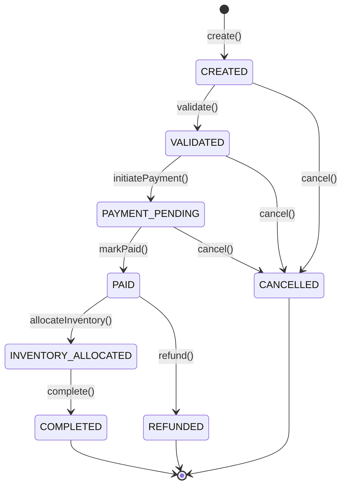

# Event-Driven Order Processing & Workflow Engine

[](https://openjdk.org/projects/jdk/21/)
[](https://spring.io/projects/spring-boot)
[](docs/architecture.md)
[](https://www.archunit.org/)
[](https://www.postgresql.org/)
[](LICENSE)

An enterprise-grade, high-throughput, fault-tolerant **Event-Driven Order Processing & Workflow Engine** engineered in **Java 21 LTS** and **Spring Boot 3.3+**. 

The system solves mission-critical distributed systems challenges: strict transactional consistency, zero dual-write message loss (Transactional Outbox Pattern), distributed transaction compensation (Saga Orchestration), and end-to-end observability.

---

## 🏛 Architectural Blueprint

Built with strict **Hexagonal Architecture (Ports and Adapters)** and **Domain-Driven Design (DDD)**:

```
com.engine.order/
├── domain/                         # Pure Java 21: ZERO framework/JPA/Spring imports
│   ├── model/                      # Aggregate Root (Order), Entities, Value Objects
│   ├── event/                      # Sealed Domain Events
│   ├── exception/                  # Domain-specific Exceptions
│   └── port/                       # Driving (in) & Driven (out) Interfaces
├── application/                    # Application Services & DTOs
│   ├── service/                    # OrderCommandService, OrderQueryService
│   └── dto/                        # Command & Response Records
└── infrastructure/                 # Concrete Adapters & Configuration
    ├── adapter/
    │   ├── in/rest/                # REST Controllers, RFC 7807 Exception Handlers
    │   └── out/persistence/        # JPA Entities, Spring Data, Mappers, Adapters
    ├── config/                     # OpenAPI, Domain Beans
    └── security/                   # Idempotency Filter
```

---

## 🔄 Deterministic Domain State Machine

The order lifecycle transitions through well-defined, immutable states enforced by domain invariants:



---

## 🚀 Features by Level

- [x] **Level 1: Pure Hexagonal Core & Deterministic State Machine**
  - Pure Java 21 domain aggregate with zero third-party dependencies.
  - Invariant validation (non-empty items, monetary consistency, currency matching).
  - Driving Ports (`CreateOrderUseCase`, `ProcessPaymentUseCase`, `CancelOrderUseCase`, `GetOrderQuery`).
  - Driven Ports (`OrderRepositoryPort`, `EventPublisherPort`, `IdempotencyStorePort`).
  - PostgreSQL schema with Flyway database migration (`V1__init_order_schema.sql`).
  - JPA persistence entities with Optimistic Locking (`@Version`).
  - REST API (`/api/v1/orders`) with RFC 7807 `ProblemDetail` errors and `Idempotency-Key` filter.
  - Quality Gate: Comprehensive JUnit 5 + AssertJ unit tests and strict ArchUnit architectural enforcement.
- [x] **Level 2: Asynchronous Event-Driven & Transactional Outbox Pattern**
  - Elimination of dual-write loss via PostgreSQL `outbox_messages` table and Flyway `V2__init_outbox_and_idempotent_consumer.sql`.
  - Atomically writes domain events in the same database transaction as the aggregate state mutation.
  - `OutboxRelayScheduler` worker polling pending events with `SELECT ... FOR UPDATE SKIP LOCKED` (safe for multi-instance scaling).
  - Idempotent Apache Kafka producer (`acks=all`, `enable.idempotence=true`, `retries=3`) publishing to `order.events`.
  - Idempotent Consumer Pattern deduplicating incoming events via `consumed_messages` table.
  - Complete `docker-compose.yml` with PostgreSQL 16, Apache Kafka (KRaft mode), and Kafdrop.
  - Quality Gate: Integration tests with embedded Kafka verifying atomic outbox insert, relay dispatch, and consumer deduplication.
- [x] **Level 3: Distributed Transactions & The Saga Pattern (Orchestration Mode)**
  - `OrderFulfillmentSagaManager` coordinating the distributed multi-step workflow: Reserve Inventory -> Authorize Payment -> Complete Order.
  - Saga state persistence in PostgreSQL via `saga_instances` table and Flyway `V3__init_saga_and_dlq_schema.sql`.
  - Automated Compensating Transactions:
    - If payment authorization fails: triggers `ReleaseInventoryCommand` rollback and marks order `CANCELLED`.
    - If inventory reservation fails: cancels order immediately without requesting payment.
  - Simulated downstream microservices (`SimulatedInventoryService` and `SimulatedPaymentService`) with configurable failure scenarios.
  - Dead Letter Queue (`order.events.dlq`) and topics (`inventory.commands`, `inventory.replies`, `payment.commands`, `payment.replies`).
  - Quality Gate: Comprehensive integration tests covering Happy Path fulfillment, payment failure compensation, and inventory out-of-stock rollback.
- [x] **Level 4: Enterprise Production-Ready (Observability, CQRS & Resilience)**
  - **CQRS Read Projection**:
    - Denormalized `order_summary_view` table via Flyway `V4__init_cqrs_read_model.sql`.
    - `OrderSummaryProjectionConsumer` asynchronously listening to `order.events` to maintain optimized query read projections.
    - High-throughput query endpoints: `GET /api/v1/orders/summary` (with filters for customer & status) and `GET /api/v1/orders/summary/{orderId}`.
  - **Distributed Tracing & Metrics Observability**:
    - Micrometer + OpenTelemetry OTLP integration propagating W3C `traceparent` context across REST, Outbox, and Kafka record headers.
    - Custom Prometheus business metrics: `orders.state.transitions.count`, `orders.saga.failures.count`, `orders.outbox.publishing.latency`, and `orders.outbox.pending.count`.
    - Spring Boot Actuator readiness and liveness health probes configured (`/actuator/health/readiness`, `/actuator/health/liveness`).
    - Complete observability stack in `docker-compose.yml`: Prometheus (9090), Grafana (3000) with pre-provisioned dashboard, and Jaeger All-in-One (16686, 4317, 4318).
  - **Resilience & Fault Tolerance (Resilience4j)**:
    - `@CircuitBreaker` and `@Retry` with exponential backoff on external payment gateways with graceful fallback routines.
  - **Production Packaging**:
    - Multi-stage `Dockerfile` leveraging Java 21 Generational ZGC (`-XX:+UseZGC -XX:+ZGenerational`) and Virtual Threads (`spring.threads.virtual.enabled=true`).
  - **Quality Gate**: Integration tests verifying asynchronous CQRS projection, Circuit Breaker state transitions/fallback, and Prometheus metric telemetry.

---

## 🛠 Tech Stack

- **Language**: Java 21 LTS (Virtual Threads, Records, Sealed Interfaces, Pattern Matching)
- **Framework**: Spring Boot 3.3+
- **Database**: PostgreSQL 16+ (with Flyway migrations V1–V4)
- **Messaging**: Apache Kafka 3.7+ (KRaft mode)
- **Resilience**: Resilience4j 2.2.0 (CircuitBreaker, Retry, Fallback)
- **Observability**: Micrometer, OpenTelemetry OTLP, Prometheus, Grafana, Jaeger
- **Architecture Enforcement**: ArchUnit 1.3.0
- **Documentation**: SpringDoc OpenAPI 2.6.0 / Swagger UI
- **Testing**: JUnit 5, AssertJ, Mockito, Spring Kafka Test, EmbeddedKafka

---

## ⚡ Getting Started

### Prerequisites
- JDK 21+ installed and configured on `PATH`
- Maven 3.9+
- Docker & Docker Compose (optional for full multi-container stack)

### Build and Run Tests
```bash
./mvnw clean test
```

### Run Multi-Container Infrastructure
```bash
docker-compose up -d
```
Services exposed:
- **PostgreSQL**: `localhost:5432`
- **Apache Kafka**: `localhost:9092`
- **Kafdrop (Kafka UI)**: [http://localhost:9000](http://localhost:9000)
- **Prometheus**: [http://localhost:9090](http://localhost:9090)
- **Grafana**: [http://localhost:3000](http://localhost:3000) (admin / admin)
- **Jaeger Tracing**: [http://localhost:16686](http://localhost:16686)

### Run the Application
```bash
./mvnw spring-boot:run
```

The application will start on `http://localhost:8080`.
- Swagger UI: [http://localhost:8080/swagger-ui.html](http://localhost:8080/swagger-ui.html)
- Actuator Health Probes: [http://localhost:8080/actuator/health](http://localhost:8080/actuator/health)
- Prometheus Metrics: [http://localhost:8080/actuator/prometheus](http://localhost:8080/actuator/prometheus)


---

## 📚 Documentation
- [Master Project Plan](docs/master_project_plan_java_event_driven.md)
- [Hexagonal Architecture & Boundaries](docs/architecture.md)
- [Domain State Machine Specification](docs/state-machine.md)
- [REST API Specification](docs/api-spec.md)
