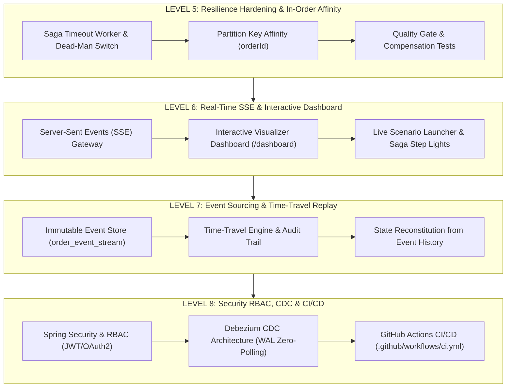

# PHASE 2 MASTER SPECIFICATION: Enterprise Hyperscale & Live Experience

## Executive Summary
This document defines the architecture and roadmap for **Phase 2** of the **Event-Driven Order Processing & Workflow Engine**. Building on the foundational Hexagonal Core, Transactional Outbox, Saga Orchestration, and CQRS Observability (Levels 1–4), Phase 2 advances the engine to hyperscale enterprise maturity:

1. **Autonomous Fault Resolution**: Distributed Saga timeout recovery and dead-man switch.
2. **Deterministic Partitioning**: Guaranteed in-order partition affinity by `orderId`.
3. **Live Operational Experience**: Real-time push telemetry via Server-Sent Events (SSE) and an interactive web visualizer.
4. **Immutable Audit & Event Sourcing**: Append-only event store with time-travel state reconstruction.
5. **Zero-Polling CDC & Production Hardening**: Debezium WAL streaming, Spring Security RBAC, and GitHub Actions CI/CD.

---

## Roadmap by Levels (Levels 5 – 8)

---

### LEVEL 5: Resilience Hardening & Deterministic In-Order Delivery
**Objective**: Guarantee that multi-step distributed transactions cannot freeze indefinitely when downstream participants fail silently, and enforce strict per-order chronological processing.

1. **Saga Timeout Worker & Dead-Man Switch**:
   - PostgreSQL schema enhancement: add `deadline_at` or query `updated_at` on `saga_instances`.
   - Scheduled task (`SagaTimeoutScheduler`) running every 5 seconds checking for saga instances stuck in `IN_PROGRESS` or `*_PENDING` longer than a configurable TTL (default: 30s).
   - On timeout: transition saga to `TIMED_OUT`, execute forced compensating transactions (`ReleaseInventoryCommand`), cancel the order with reason `"Saga execution timed out waiting for participant reply"`, and mark saga as `COMPENSATED`.
   - Expose Prometheus metric `orders.saga.timeout.count`.
2. **Guaranteed Partition Key Affinity (`orderId`)**:
   - Ensure every Kafka producer record (Outbox Relay, Saga Commands, Downstream Simulators, Reply Topics) explicitly uses `orderId.toString()` as the Kafka message key.
   - Configure topic partition count and verify that all messages for an individual order hash to the exact same partition, eliminating race conditions and out-of-order state mutations under high concurrency.
3. **Level 5 Quality Gate**:
   - Automated integration tests: simulate an unresponsive payment service, verify that after the TTL threshold the timeout worker triggers rollback, inventory is released, and order is cancelled.

---

### LEVEL 6: Real-Time SSE & Live Interactive Visualizer Dashboard
**Objective**: Provide real-time client push notifications and an operational control dashboard with live saga step visualization.

1. **Server-Sent Events (SSE) Streaming Engine**:
   - `OrderSseNotificationService` managing client connections (`SseEmitter`).
   - Endpoint `GET /api/v1/orders/{orderId}/live`: allows customers and frontend clients to subscribe to real-time status updates without polling.
   - Endpoint `GET /api/v1/orders/live`: global real-time event feed for operational staff.
   - Automatically broadcast events whenever order transitions state or saga steps advance.
2. **Interactive Live Dashboard (`http://localhost:8080/dashboard`)**:
   - Clean, modern UI (Dark Mode, responsive layout, CSS micro-animations).
   - **One-Click Scenario Simulator**:
     - 🟢 *Create Standard Order (Happy Path)*: Watch items validate, inventory reserve, payment authorize, and order complete live.
     - 🔴 *Simulate Payment Failure*: Watch payment get rejected and witness immediate compensating inventory release.
     - 🟡 *Simulate Out of Stock*: Watch immediate inventory reservation rejection and order cancellation.
     - ⏱️ *Simulate Gateway Outage / Timeout*: Watch the dead-man switch intervene after timeout.
   - **Saga Step Visualizer**: Interactive step progress tracker (Inventory -> Payment -> Complete) with live pulsing LED indicators (Green = Done, Yellow = Running, Red = Compensating/Failed).
   - **Live Event Audit Table**: Dynamic feed showing incoming events in real time via SSE.
3. **Level 6 Quality Gate**:
   - Integration tests verifying SSE subscription, event delivery, and controller endpoints.

---

### LEVEL 7: Event Sourcing, Audit Trail & Time-Travel Debugging
**Objective**: Transform the domain into an immutable append-only event store, enabling full financial audit trails and time-travel state reconstruction.

1. **Immutable Event Store (`order_event_stream`)**:
   - Flyway migration `V5__init_event_store.sql` creating `order_event_stream`:
     - `event_id` (UUID, PK)
     - `order_id` (VARCHAR, Indexed)
     - `sequence_number` (BIGINT, Unique per order)
     - `event_type` (VARCHAR)
     - `payload` (JSONB / TEXT)
     - `metadata` (JSONB / TEXT)
     - `created_at` (TIMESTAMPTZ)
   - `EventStorePort` and `EventStoreJpaAdapter` appending domain events within the aggregate transaction.
2. **Time-Travel & Historical Replay Engine**:
   - `OrderReplayService`:
     - Reconstruct the state of any order at any historical point in time (`targetVersion` or `timestamp`) by playing back events from version 1 up to $N$.
   - Endpoints:
     - `GET /api/v1/orders/{orderId}/history`: complete audit trail of every state change and payload diff.
     - `GET /api/v1/orders/{orderId}/replay?version={v}`: reconstitutes order state at version $v$.
3. **Level 7 Quality Gate**:
   - Unit & integration tests verifying that replaying events faithfully reconstitutes aggregate state and that sequence numbers enforce optimistic concurrency.

---

### LEVEL 8: Security RBAC, Debezium CDC Architecture & CI/CD Pipeline
**Objective**: Secure API boundaries with role-based access control, provide a production CDC blueprint for zero-polling, and automate continuous integration.

1. **Spring Security & Role-Based Access Control (RBAC)**:
   - Add `spring-boot-starter-security`.
   - Roles:
     - `ROLE_CUSTOMER`: Can only create orders and query orders where `customerId` matches their authenticated principal.
     - `ROLE_ADMIN`: Access to CQRS summaries, manual saga trigger/cancel, Actuator metrics, and audit replay endpoints.
   - Support for lightweight JWT authorization headers.
2. **Debezium CDC Zero-Polling Outbox Blueprint**:
   - Add `debezium/connect` to `docker-compose.yml` configured to stream PostgreSQL WAL (`wal_level=logical`).
   - Provide Debezium connector registration configuration (`debezium-postgres-outbox-connector.json`) mapping `outbox_messages` directly into Kafka topics with sub-millisecond latency.
3. **GitHub Actions CI/CD Pipeline**:
   - Create `.github/workflows/ci.yml`:
     - Triggers on push and pull requests to `main`.
     - Sets up JDK 21 and Maven cache.
     - Runs `./mvnw clean test` (all unit, ArchUnit, and integration tests).
     - Validates multi-stage Docker build.
4. **Level 8 Quality Gate**:
   - Security tests verifying 401 Unauthorized for unauthenticated requests, 403 Forbidden for unauthorized roles, and 200 OK for valid credentials.
   - GitHub Actions workflow test runs.
