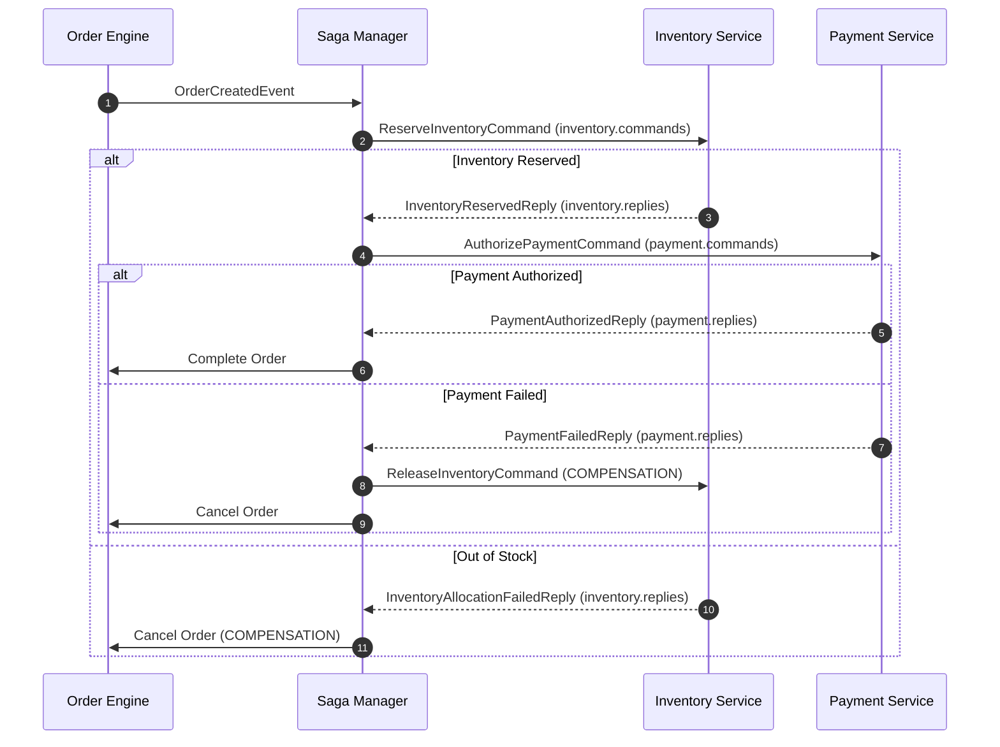

# Distributed Workflows: Saga Orchestration & Event Sourcing

## 1. Saga Orchestration Engine

The order fulfillment workflow crosses multiple distributed microservice boundaries (Orders, Inventory, Payments). The engine uses **Orchestration-based Saga** coordinated by `OrderFulfillmentSagaManager`.

### 1.1 Workflow State Machine



### 1.2 Saga Dead-Man Switch & Timeout Recovery
If an external service crashes or Kafka drops replies, sagas would traditionally remain stuck in `INVENTORY_PENDING` or `PAYMENT_PENDING` indefinitely.

The engine implements a **Dead-Man Switch**:
- `SagaTimeoutScheduler` polls for active sagas older than configured TTL (e.g. 30 seconds).
- Transitions saga status to `TIMED_OUT`.
- Dispatches emergency compensating transactions (`ReleaseInventoryCommand` if inventory was already held).
- Cancels the order in the aggregate.
- Increments the `orders.saga.timeout.count` Prometheus metric.

---

## 2. Event Sourcing & Time-Travel Debugging

### 2.1 Immutable Event Store Schema
Every state mutation on an `Order` aggregate is appended to the `order_event_stream` table:

```sql
CREATE TABLE order_event_stream (
    event_id VARCHAR(64) PRIMARY KEY,
    order_id VARCHAR(64) NOT NULL,
    sequence_number BIGINT NOT NULL,
    event_type VARCHAR(128) NOT NULL,
    payload TEXT NOT NULL,
    metadata TEXT,
    created_at TIMESTAMP WITH TIME ZONE NOT NULL,
    CONSTRAINT uq_order_event_stream_seq UNIQUE (order_id, sequence_number)
);
```

- **Strict Monotonic Ordering**: The unique constraint `(order_id, sequence_number)` guarantees deterministic optimistic concurrency per event stream.
- **Auditability**: Complete forensic history of who, what, and when changed an order.

### 2.2 Time-Travel Aggregate Replay
The `OrderReplayService` allows operators and auditors to inspect the exact state of an order at any historical sequence version:

1. Client requests `GET /api/v1/orders/{orderId}/replay?targetVersion=3`.
2. Engine loads all events where `sequence_number <= 3`.
3. Reconstitutes the domain aggregate step by step by folding the event sequence.
4. Returns the reconstructed state at version 3 without mutating active database records.

---

## 3. Real-Time Server-Sent Events (SSE) & Dashboard

### 3.1 Reactive Updates
- `OrderSseNotificationService` maintains active `SseEmitter` connections for:
  - Specific order tracking: `/api/v1/orders/{orderId}/live`
  - Global system feed: `/api/v1/orders/live`
- When CQRS projection or Saga advances, events are streamed with zero polling overhead.

### 3.2 Visualizer UI
- Located at `/dashboard`.
- Scenario simulator triggers real workflows.
- Live SVG flowchart illuminates status transitions dynamically.
