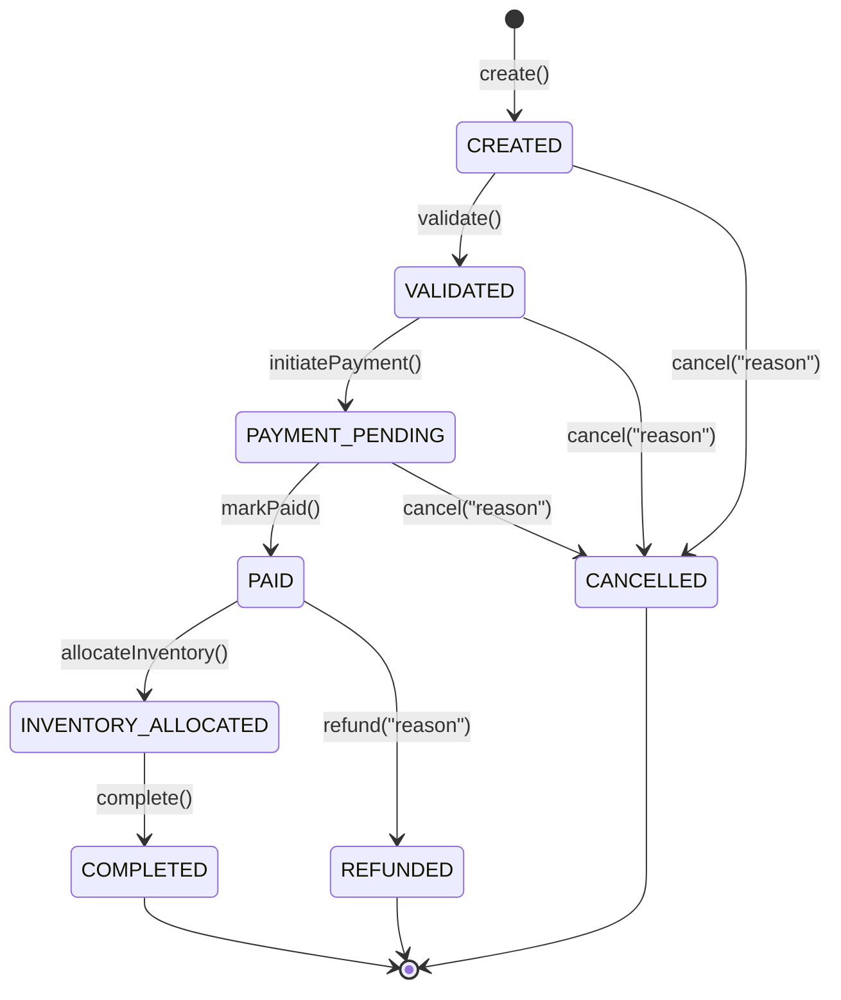

# Domain State Machine & Transition Rules

## 1. Overview
The order lifecycle in the engine is managed by a deterministic state machine within the `Order` aggregate root in the pure domain layer.

State transitions are protected by domain invariants, and invalid state jumps throw an unchecked `InvalidStateTransitionException`.

## 2. Order States (`OrderState`)

| State | Type | Description |
| :--- | :--- | :--- |
| `CREATED` | Initial | Order created by customer with validated non-empty line items and monetary total. |
| `VALIDATED` | Intermediate | Customer credit/rules and basic parameters verified. |
| `PAYMENT_PENDING` | Intermediate | Payment transaction initiated with payment provider/orchestrator. |
| `PAID` | Milestone | Payment successfully captured. |
| `INVENTORY_ALLOCATED` | Milestone | Warehouse / inventory reserved or picked for fulfillment. |
| `COMPLETED` | Terminal | Order fulfilled and delivered to customer. Cannot be cancelled. |
| `CANCELLED` | Terminal | Cancelled before payment or fulfillment. |
| `REFUNDED` | Terminal | Order cancelled after payment; refund issued to customer. |

## 3. Invariants & Rules

1. **Items Non-Empty**: An order must have at least 1 `OrderItem`.
2. **Positive Quantity**: Each `OrderItem` must have a quantity > 0.
3. **Price Matching**: Item subtotal = `quantity * unitPrice`. Total order amount must strictly equal the sum of all item subtotals.
4. **Currency Consistency**: All items and order total must share the identical ISO currency (e.g. `USD`, `EUR`).
5. **Cancellation Window**:
   - Cancellation is permitted in `CREATED`, `VALIDATED`, or `PAYMENT_PENDING` states.
   - If an order is already `PAID`, attempting a cancellation requires invoking `refund()`, moving to `REFUNDED`.
   - `COMPLETED` orders cannot be cancelled or refunded through the standard cancellation path.
6. **Immutable Events**: Each valid transition produces a domain event (`OrderCreatedEvent`, `OrderPaidEvent`, `OrderCancelledEvent`, etc.) with a UTC timestamp and the order ID.
